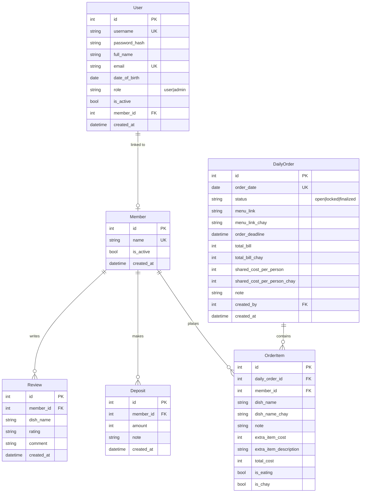

# Lunch With Me - Hệ Thống Đặt Cơm Nhóm

Xây dựng hệ thống web giúp team đặt cơm hàng ngày, theo dõi chi phí và quản lý tiền deposit/nợ — thay thế hoàn toàn file Excel hiện tại.

## Phân Tích Dữ Liệu Từ Excel

Sau khi phân tích file [ĐẶT CƠM 2026.xlsx](file:///d:/Project/lunch_with_me/ĐẶT%20CƠM%202026.xlsx), workflow hiện tại:

| Sheet | Mô tả |
|-------|-------|
| **Daily sheets** (VD: `08-06-2026`) | Mỗi ngày 1 sheet: list thành viên, mỗi người điền tên món (col C), món chay (col D), note (col F), có món thêm (col I, VD: trà tắc, cơm thêm). Sau khi đặt, admin nhập tổng tiền → chia đều cho số người ăn. Người có món thêm bị cộng riêng. |
| **DEPOSIT** | Theo dõi tiền nạp vào (col B), tổng sử dụng (col C), còn lại (col D). Mỗi cột từ J trở đi là chi phí từng ngày của mỗi người. |
| **Review món** | Review chất lượng món ăn (tên món, rating, comment). |

### Logic chia tiền (quan trọng):
1. Admin nhập **tổng tiền bill** sau khi đặt
2. Trừ tổng giá **món thêm** (admin phỏng đoán giá)
3. Số tiền còn lại **chia đều** cho số người ăn
4. Mỗi người trả = phần chia đều + giá món thêm (nếu có)

**VD ngày 05-06-2026**: Tổng bill = 143k, Kiêm mua thêm "Cơm thêm + Trà tắc" = 10k → (143 - 10) / 4 = 33k/người. Kiêm trả = 33 + 10 = 43k.

---

## Quyết Định Thiết Kế (Đã Xác Nhận)

| Câu hỏi | Quyết định |
|---------|------------|
| **Đơn vị tiền** | Nghìn đồng (k) — VD: 27 = 27,000 VNĐ |
| **Authentication** | Có — username/password đầy đủ, phân quyền user/admin |
| **Thông báo** | Gửi qua Outlook email (sao kê + nhắc thanh toán) |
| **Deadline** | Có — cutoff time cấu hình được cho mỗi order |
| **Import Excel** | Có — import lịch sử từ file Excel 2026 |
| **Deploy** | Cần deploy (Railway/Render backend, Vercel frontend) |
| **Báo cáo** | Export CSV theo tuần/tháng |
| **Nhắc nhở** | Hiển thị ai chưa chọn món khi order đang mở |
| **Lịch sử per-person** | Có — chi tiêu theo từng ngày như sheet DEPOSIT |

---

## Tech Stack

| Layer | Công nghệ |
|-------|-----------|
| **Frontend** | Next.js 15 (App Router) + Vanilla CSS |
| **Backend** | FastAPI (Python) |
| **Database** | SQLite (via SQLAlchemy) — đơn giản, zero config, đủ cho team nhỏ |
| **ORM** | SQLAlchemy 2.0 |
| **Auth** | JWT (python-jose) + bcrypt password hashing |
| **Email** | SMTP qua Outlook (smtplib / fastapi-mail) |
| **Scheduler** | APScheduler — chạy deadline reminder, monthly statement |

---

## Project Structure

```
d:\Project\lunch_with_me\
├── backend/
│   ├── app/
│   │   ├── main.py
│   │   ├── database.py
│   │   ├── models.py              ← cần thêm User model
│   │   ├── schemas.py             ← cần thêm Auth schemas
│   │   ├── routers/
│   │   │   ├── auth.py            ← [NEW] login, register, refresh token
│   │   │   ├── members.py
│   │   │   ├── orders.py
│   │   │   ├── order_items.py
│   │   │   ├── deposits.py
│   │   │   ├── reviews.py
│   │   │   ├── reports.py         ← [NEW] export CSV tuần/tháng
│   │   │   └── admin.py           ← [NEW] import Excel, manage users
│   │   ├── services/
│   │   │   ├── cost_calculator.py
│   │   │   ├── email_service.py   ← [NEW] gửi email qua Outlook SMTP
│   │   │   ├── scheduler.py       ← [NEW] APScheduler jobs
│   │   │   ├── excel_importer.py  ← [NEW] parse và import Excel
│   │   │   └── report_generator.py ← [NEW] tạo CSV báo cáo
│   │   └── core/
│   │       ├── auth.py            ← [NEW] JWT utils, password hashing
│   │       └── config.py          ← [NEW] settings từ .env
│   ├── requirements.txt           ← cần thêm: python-jose, passlib, APScheduler, openpyxl, fastapi-mail
│   └── lunch.db
├── frontend/
│   ├── src/
│   │   ├── app/
│   │   │   ├── layout.js
│   │   │   ├── page.js            ← Dashboard (đã có)
│   │   │   ├── globals.css
│   │   │   ├── login/
│   │   │   │   └── page.js        ← [NEW] login form
│   │   │   ├── order/[id]/page.js ← (đã có)
│   │   │   ├── deposit/page.js    ← (đã có) + cần thêm per-day history
│   │   │   ├── history/page.js    ← (đã có)
│   │   │   ├── reports/
│   │   │   │   └── page.js        ← [NEW] báo cáo tuần/tháng + export CSV
│   │   │   ├── reviews/page.js    ← (đã có)
│   │   │   └── admin/
│   │   │       ├── page.js        ← (đã có)
│   │   │       ├── users/
│   │   │       │   └── page.js    ← [NEW] quản lý users
│   │   │       └── import/
│   │   │           └── page.js    ← [NEW] import Excel UI
│   │   ├── components/
│   │   │   ├── Sidebar.js         ← (đã có) + route guard
│   │   │   ├── Toast.js           ← (đã có)
│   │   │   ├── AuthGuard.js       ← [NEW] redirect nếu chưa login
│   │   │   └── PendingMembersAlert.js ← [NEW] ai chưa chọn món
│   │   └── lib/
│   │       ├── api.js             ← (đã có) + auth headers
│   │       └── auth.js            ← [NEW] token storage, login/logout helpers
└── ĐẶT CƠM 2026.xlsx
```

---

## Database Models

### Thay đổi cần thiết

#### [MODIFY] `models.py` — Thêm `User`, cập nhật `DailyOrder`

```python
class User(Base):
    __tablename__ = "users"

    id = Column(Integer, primary_key=True)
    username = Column(String(50), unique=True, nullable=False)
    password_hash = Column(String(255), nullable=False)
    full_name = Column(String(100), nullable=False)
    email = Column(String(255), unique=True, nullable=False)
    date_of_birth = Column(Date, nullable=True)
    role = Column(String(10), default="user")  # "user" | "admin"
    is_active = Column(Boolean, default=True)
    member_id = Column(Integer, ForeignKey("members.id"), nullable=True)  # link tới Member
    created_at = Column(DateTime, default=datetime.utcnow)
```

**Lưu ý**: `User` (login account) tách khỏi `Member` (người ăn). Một số member có thể không có account (VD: người thỉnh thoảng ăn, admin nhập hộ). Link qua `member_id`.

```python
# Thêm vào DailyOrder:
order_deadline = Column(DateTime, nullable=True)  # Deadline chọn món
```

#### ERD tổng hợp



---

## Backend API Endpoints — Mới và Cần Bổ Sung

### [NEW] Auth Router — `auth.py`

| Method | Endpoint | Mô tả | Quyền |
|--------|----------|-------|-------|
| `POST` | `/api/auth/register` | Đăng ký tài khoản mới | Admin only |
| `POST` | `/api/auth/login` | Login, trả về JWT token | Public |
| `POST` | `/api/auth/logout` | Invalidate token | User |
| `GET` | `/api/auth/me` | Thông tin user hiện tại | User |
| `PUT` | `/api/auth/me` | Cập nhật profile | User |
| `POST` | `/api/auth/change-password` | Đổi mật khẩu | User |

**JWT Flow**:
- Access token: 8h TTL (đủ cho 1 ngày làm việc)
- Lưu trong `localStorage` (hoặc httpOnly cookie — cân nhắc)
- Mọi request cần auth: Header `Authorization: Bearer <token>`

### [NEW] Reports Router — `reports.py`

| Method | Endpoint | Mô tả | Quyền |
|--------|----------|-------|-------|
| `GET` | `/api/reports/weekly` | Báo cáo tuần (params: `week`, `year`) | User |
| `GET` | `/api/reports/monthly` | Báo cáo tháng (params: `month`, `year`) | User |
| `GET` | `/api/reports/weekly/export` | Export CSV tuần | User |
| `GET` | `/api/reports/monthly/export` | Export CSV tháng | User |
| `GET` | `/api/reports/member/{id}` | Chi tiêu per-person theo ngày | User |

**Format CSV export**:
```
Ngày,Tên,Món,Ăn chay,Món thêm,Giá món thêm,Tổng cá nhân
2026-06-05,Trọng,Gà phi lê,Không,,0,33
2026-06-05,Kiêm,Cá ngừ,Không,Trà tắc + Cơm thêm,10,43
```

### [NEW] Admin Router — `admin.py`

| Method | Endpoint | Mô tả | Quyền |
|--------|----------|-------|-------|
| `GET` | `/api/admin/users` | List tất cả users | Admin |
| `POST` | `/api/admin/users` | Tạo user mới | Admin |
| `PUT` | `/api/admin/users/{id}` | Cập nhật user | Admin |
| `DELETE` | `/api/admin/users/{id}` | Deactivate user | Admin |
| `POST` | `/api/admin/import/excel` | Upload và import file Excel | Admin |
| `GET` | `/api/admin/import/preview` | Preview data trước khi import | Admin |

### [MODIFY] Orders Router — Thêm deadline

| Method | Endpoint | Mô tả |
|--------|----------|-------|
| `POST` | `/api/orders` | Tạo order + set `order_deadline` |
| `GET` | `/api/orders/today` | Trả thêm `is_deadline_passed`, `minutes_remaining` |

### Các endpoint hiện tại (giữ nguyên, không đổi)

- `GET/POST/PUT /api/members`
- `GET/POST/PUT/DELETE /api/orders/{id}/items`
- `GET/POST/DELETE /api/deposits`
- `GET/POST/DELETE /api/reviews`

---

## Services Mới Cần Implement

### [NEW] `email_service.py` — Outlook SMTP

```python
# Cấu hình Outlook SMTP:
SMTP_HOST = "smtp-mail.outlook.com"
SMTP_PORT = 587
SMTP_USER = "your@outlook.com"
SMTP_PASSWORD = "..."  # từ .env

# 3 loại email:
# 1. Nhắc chọn món (gửi khi order mở, nếu gần deadline mà chưa chọn)
# 2. Sao kê tháng (gửi đầu tháng tiếp theo)
# 3. Nhắc nạp tiền (khi balance < threshold, VD: < 50k)
```

**Email templates**:

*Nhắc chọn món* (gửi trước deadline 30 phút):
> Bạn ơi, order hôm nay đóng lúc **11:30**. Bạn chưa chọn món! [Chọn ngay →]

*Sao kê tháng* (gửi ngày 1 hàng tháng):
> Tháng 6/2026: Bạn đã ăn **22 ngày**, tổng chi phí **726k**, số dư còn lại **274k**.

*Nhắc nạp tiền*:
> Số dư của bạn còn **30k**, sắp hết. Hãy nạp thêm tiền để tránh gián đoạn.

### [NEW] `scheduler.py` — APScheduler Jobs

```python
# Job 1: Kiểm tra deadline mỗi 5 phút
# → Nếu còn 30 phút tới deadline, gửi email nhắc những người chưa chọn

# Job 2: Chạy 8:00 sáng mỗi ngày làm việc
# → Tạo auto-reminder nếu order đang open

# Job 3: Chạy ngày 1 hàng tháng lúc 8:00
# → Gửi sao kê tháng trước cho tất cả members có email

# Job 4: Sau mỗi lần finalize order
# → Kiểm tra balance, gửi nhắc nạp tiền nếu balance < 50k
```

### [NEW] `excel_importer.py` — Import từ Excel

```python
# Flow:
# 1. Parse từng sheet có tên dạng DD-MM-YYYY
# 2. Map tên thành viên trong Excel → Member.id trong DB
# 3. Với mỗi ngày: tạo DailyOrder (status=finalized), tạo OrderItems
# 4. Parse sheet DEPOSIT → tạo Deposit records
# 5. Return preview trước khi commit (số ngày, số records)

# Lưu ý:
# - Nếu ngày đã có trong DB → skip (không overwrite)
# - Tên mapping có thể cần manual confirm (VD: "Hiếu" vs "Nguyễn Văn Hiếu")
```

### [NEW] `report_generator.py`

```python
# weekly_report(week, year) → dict với:
#   - Danh sách ngày trong tuần
#   - Per-person: số ngày ăn, tổng chi phí
#   - Tổng team: bill, số người ăn trung bình

# monthly_report(month, year) → tương tự nhưng theo tháng

# export_csv(report_data) → bytes (CSV content)
```

---

## Frontend Pages Mới / Cập Nhật

### [NEW] `login/page.js`
- Form: username + password
- Lưu JWT token vào localStorage
- Redirect về `/` sau login
- Hiển thị lỗi sai mật khẩu

### [NEW] `lib/auth.js`
```js
// getToken() — lấy token từ localStorage
// setToken(token) / clearToken()
// isLoggedIn() — check token còn hạn
// getUser() — decode payload từ JWT
// isAdmin() — check role
```

### [NEW] `components/AuthGuard.js`
- Wrap toàn bộ layout
- Redirect về `/login` nếu chưa có token hoặc token expired

### [NEW] `components/PendingMembersAlert.js`
- Hiển thị banner trên Dashboard khi order đang open
- List tên những người `is_eating=False`
- Ẩn đi khi tất cả đã chọn hoặc order locked

### [MODIFY] Dashboard `page.js`
- Hiển thị countdown tới deadline (VD: "Còn 23 phút để chọn món")
- Khi hết deadline → disable form chọn món, hiển thị thông báo

### [MODIFY] Deposit `page.js` — Thêm per-day history
- Tab "Tổng hợp": Bảng tên | Nạp vào | Sử dụng | Còn lại (đã có)
- Tab "Chi tiết": Bảng theo ngày, mỗi hàng = 1 ngày, mỗi cột = 1 người (giống sheet DEPOSIT)

### [NEW] `reports/page.js`
- Toggle: Tuần / Tháng
- Date picker chọn tuần hoặc tháng
- Bảng tổng hợp: Ngày | Tổng bill | Số người | Chi phí mỗi người
- Bảng per-person trong kỳ: Tên | Số ngày ăn | Tổng chi phí
- Nút Export CSV

### [NEW] `admin/users/page.js`
- Bảng users: Tên | Username | Email | Role | Trạng thái
- Modal thêm/sửa user (form đầy đủ)
- Link member_id với Member

### [NEW] `admin/import/page.js`
- Upload file Excel (.xlsx)
- Preview: bao nhiêu ngày, bao nhiêu records tìm thấy
- Mapping tên nếu cần (dropdown)
- Nút "Import" để commit

---

## Thứ Tự Thực Hiện (Cập Nhật)

### Phase 1 — Auth & Security (ưu tiên cao, làm trước)
1. Thêm `User` model vào `models.py`
2. Thêm `core/config.py` (settings từ .env: JWT_SECRET, SMTP config)
3. Implement `core/auth.py` (JWT utils, password hash)
4. Implement `routers/auth.py` (login, me, change-password)
5. Thêm middleware check token cho tất cả routes cần auth
6. Frontend: `lib/auth.js`, `components/AuthGuard.js`, `login/page.js`
7. Cập nhật `lib/api.js` để attach Bearer token

### Phase 2 — Deadline Feature
1. Thêm `order_deadline` vào `DailyOrder` model
2. Cập nhật `DailyOrderCreate`, `DailyOrderResponse` schemas
3. Thêm computed fields `is_deadline_passed`, `minutes_remaining` vào response
4. Frontend: countdown timer trên Dashboard, disable form khi hết giờ

### Phase 3 — Email & Notifications
1. Setup `email_service.py` với Outlook SMTP
2. Tạo email templates (HTML)
3. Implement `scheduler.py` với APScheduler
4. Thêm email config vào `.env`
5. Test gửi email thủ công qua endpoint `/api/admin/send-test-email`

### Phase 4 — Reports & Export
1. Implement `report_generator.py`
2. Implement `routers/reports.py`
3. Frontend: `reports/page.js`
4. Cập nhật Deposit page thêm tab chi tiết per-day

### Phase 5 — Excel Import
1. Implement `excel_importer.py` (parse + mapping logic)
2. Implement `routers/admin.py` import endpoints
3. Frontend: `admin/import/page.js` với upload + preview UI

### Phase 6 — Admin User Management
1. Implement `routers/admin.py` user CRUD
2. Frontend: `admin/users/page.js`

### Phase 7 — Deploy
1. Tạo `.env.example` với tất cả env vars cần thiết
2. Tạo `Dockerfile` cho backend
3. Config `next.config.mjs` cho production API URL
4. Deploy backend lên Railway, frontend lên Vercel
5. Setup SQLite backup định kỳ (hoặc migrate sang PostgreSQL nếu cần)

---

## Environment Variables Cần Thiết

```env
# Backend .env
DATABASE_URL=sqlite:///./lunch.db
JWT_SECRET=your-secret-key-here
JWT_ALGORITHM=HS256
JWT_EXPIRE_HOURS=8

# Outlook SMTP
SMTP_HOST=smtp-mail.outlook.com
SMTP_PORT=587
SMTP_USER=your@outlook.com
SMTP_PASSWORD=your-app-password

# App config
APP_NAME=Lunch With Me
FRONTEND_URL=http://localhost:3000
LOW_BALANCE_THRESHOLD=50  # nghìn đồng — nhắc nạp tiền khi dưới mức này
ORDER_DEADLINE_DEFAULT=11:30  # giờ cắt order mặc định

# Frontend .env.local
NEXT_PUBLIC_API_URL=http://localhost:8000
```

---

## Verification Plan

### Automated Tests
```bash
# Backend tests
cd backend && python -m pytest tests/ -v

# Frontend build check
cd frontend && npm run build
```

### Manual Verification Flows

1. **Auth flow**: Register → Login → Access protected page → Logout → Verify redirect
2. **Order flow**: Admin tạo order → Members chọn món → Check deadline countdown → Admin finalize → Kiểm tra chia tiền
3. **Email flow**: Tạo order gần deadline → Đợi nhắc nhở → Finalize → Kiểm tra sao kê
4. **Import flow**: Upload Excel → Preview data → Confirm import → Verify balance matches Excel
5. **Report flow**: Xem báo cáo tháng → Export CSV → Mở file và verify số liệu
6. **Deposit tracking**: Nạp tiền → Ăn vài ngày → Xem per-day history → Verify số dư

---

## Trạng Thái Hiện Tại

| Component | Trạng thái |
|-----------|------------|
| Backend models | ✅ Xong (cần thêm User) |
| Backend routers (orders, members, deposits, reviews) | ✅ Xong |
| Cost calculator | ✅ Xong |
| Frontend tất cả pages cơ bản | ✅ Xong |
| **Timezone bug** | ✅ **Đã fix** (19/06/2026) |
| Auth (JWT + User model) | ⏳ Chưa làm |
| Deadline feature | ⏳ Chưa làm |
| Email notifications | ⏳ Chưa làm |
| Reports + CSV export | ⏳ Chưa làm |
| Excel import | ⏳ Chưa làm |
| Admin user management | ⏳ Chưa làm |
| Deploy | ⏳ Chưa làm |
